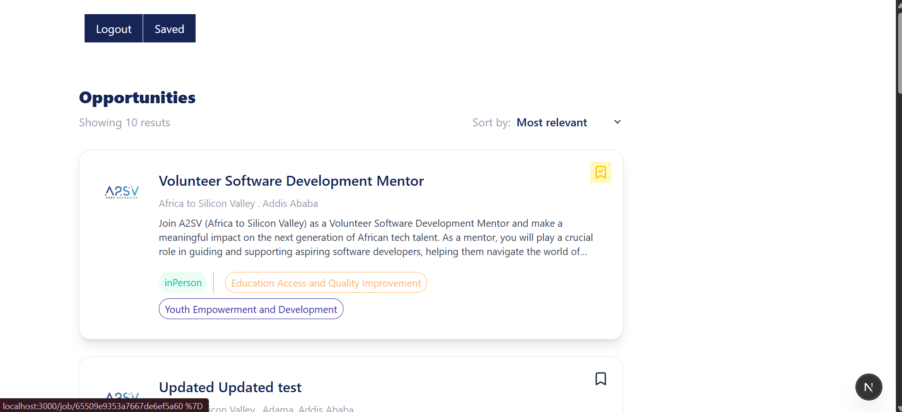
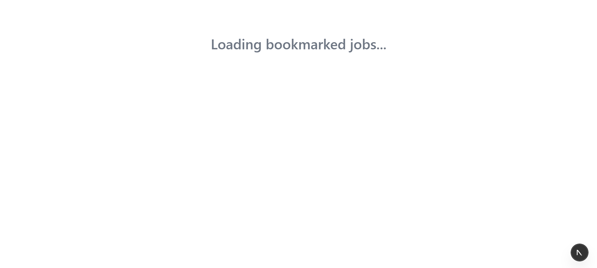
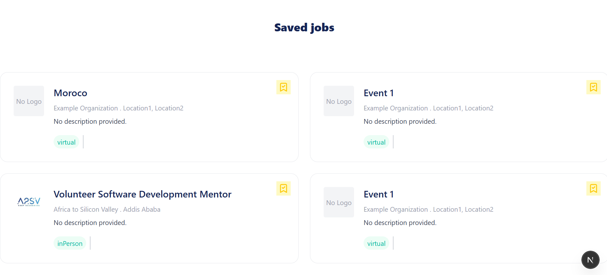
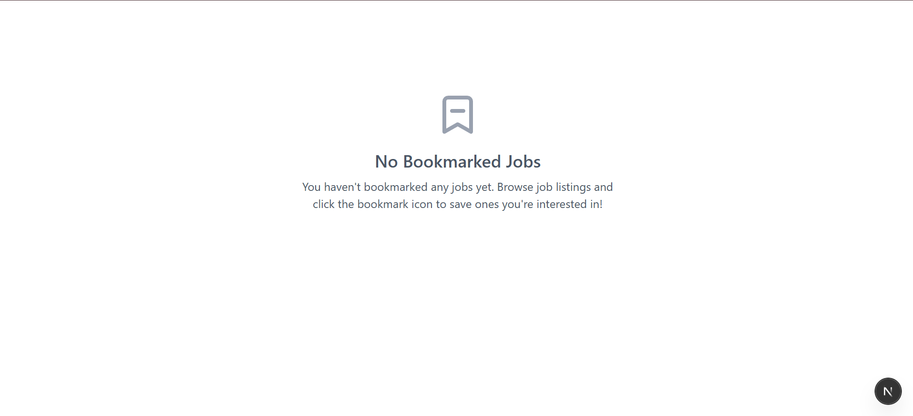
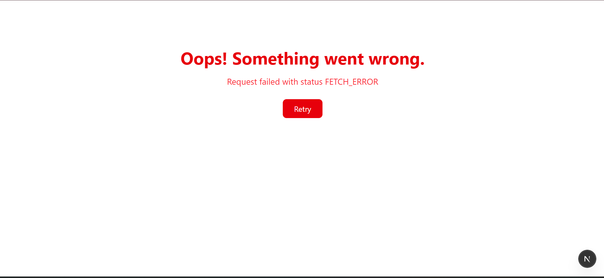
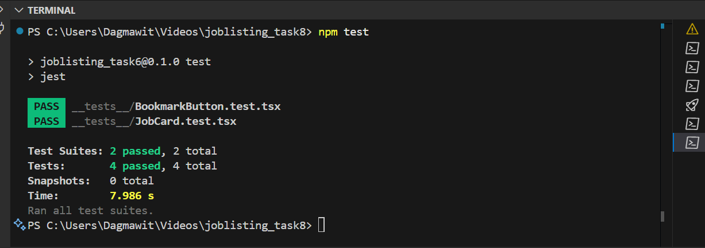
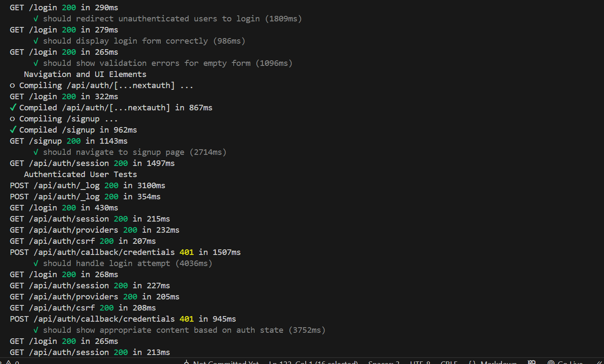
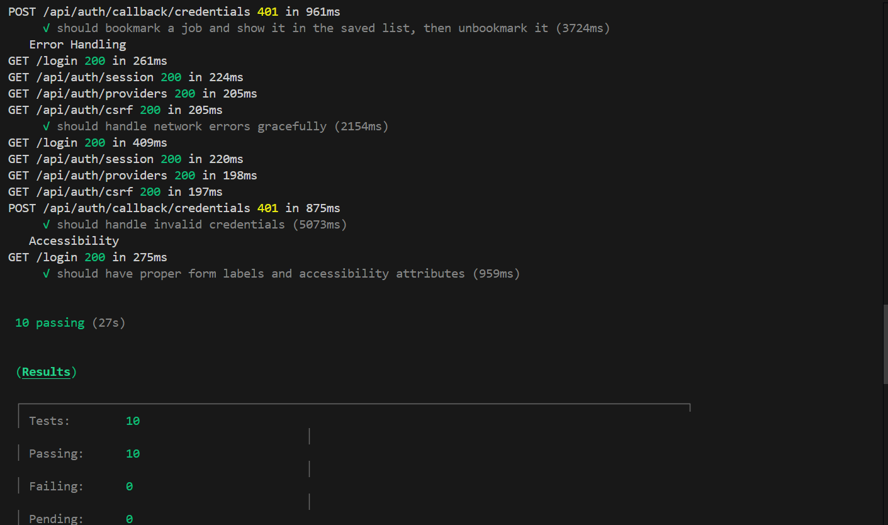

# Job Listing Application with Bookmark Functionality

A modern, full-featured job listing application built with **Next.js**, **NextAuth**, **Redux Toolkit**, and **Tailwind CSS**. Features comprehensive authentication, job browsing, and bookmark functionality with complete testing coverage.

---

## Features

### **Authentication System**

### **Job Listing & Management**

### **Bookmark Functionality**

### **Testing Coverage**

- **Unit Tests**: Jest-based component and functionality testing
- **E2E Tests**: Cypress end-to-end testing for complete user workflows
- **Authentication Testing**: Comprehensive auth flow testing
- **Bookmark Testing**: Complete bookmark functionality testing

---

## 🛠 Tech Stack

- **Framework**: [Next.js 15](https://nextjs.org/) with App Router
- **Authentication**: [NextAuth.js](https://next-auth.js.org/) with JWT
- **State Management**: [Redux Toolkit](https://redux-toolkit.js.org/) with RTK Query
- **Forms**: [React Hook Form](https://react-hook-form.com/)
- **Styling**: [Tailwind CSS](https://tailwindcss.com/)
- **Language**: [TypeScript](https://www.typescriptlang.org/)
- **Testing**: [Jest](https://jestjs.io/) + [Cypress](https://www.cypress.io/)
- **Icons**: [Lucide React](https://lucide.dev/)
- **Backend API**: Custom REST API (https://akil-backend.onrender.com/)

---

## 📦 Installation and Setup

1. **Clone the repository**

   ```bash
   git clone <repository-url>
   cd job-listing-app
   ```

2. **Install dependencies**

   ```bash
   npm install
   ```

3. **Environment Setup**
   Create a `.env.local` file with required environment variables:

   ```env
   NEXTAUTH_SECRET=your-secret-key
   NEXTAUTH_URL=http://localhost:3000
   ```

4. **Run the development server**

   ```bash
   npm run dev
   ```

5. **Open your browser**
   Navigate to `http://localhost:3000`

---

## Application Screenshots

### **Homepage - Job Listings**


_Main job listing page showing available positions with bookmark buttons. Users can browse jobs and bookmark their favorites._

### **Loading State**


_Loading animation displayed while fetching job data from the API._

### **Saved Jobs Page**


_Bookmark page showing all saved jobs. Users can view and manage their bookmarked positions._

### **No Saved Jobs State**


_Empty state shown when user hasn't bookmarked any jobs yet, with helpful guidance._

### **Error Handling**


_Error page displayed when something goes wrong, with retry functionality._

---

## 🧪 Testing

### **Running Tests**

#### Unit Tests (Jest)

```bash
# Run all unit tests
npm run test:unit

# Run tests in watch mode
npm test

# Run tests with coverage
npm run test:unit -- --coverage
```

#### End-to-End Tests (Cypress)

```bash
# Run E2E tests (automatically starts dev server)
npm run test:e2e

# Open Cypress Test Runner
npm run test:e2e:open

# Run all tests (unit + E2E)
npm run test:all
```

### **Test Screenshots**

#### **Jest Unit Tests Results**


_Screenshot showing Jest unit test results with all tests passing. Includes component tests for BookmarkButton and JobCard._

#### **Cypress E2E Tests Results**




_Screenshot showing Cypress end-to-end test results with comprehensive bookmark functionality testing._

---

## 🔧 API Integration

### **Endpoints Used**

- **Base URL**: `https://akil-backend.onrender.com/`
- **Authentication**: JWT Bearer token in Authorization header

#### **Job Endpoints**

- `GET /opportunities/search` - Get all job listings
- `GET /opportunities/:id` - Get specific job details

#### **Bookmark Endpoints**

- `GET /bookmarks` - Get user's bookmarked jobs
- `POST /bookmarks/:eventID` - Bookmark a job (empty body)
- `DELETE /bookmarks/:eventID` - Remove bookmark
